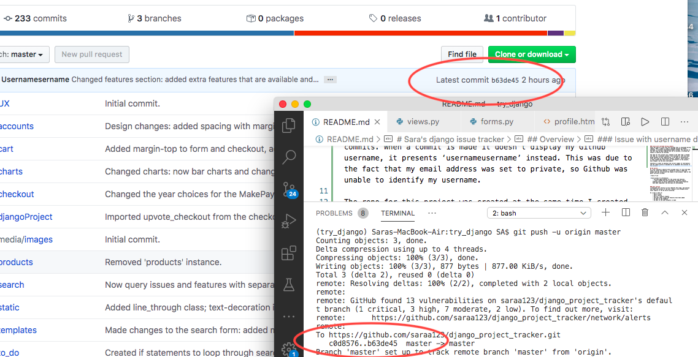

# Sara's Django Issue Tracker 

Heroku live link: 
https://sara-django-issue-tracker.herokuapp.com

## Overview 
The purpose of this project was to create a website utilising Django. The website created allows users to track and submit free issue requests, as well as purchase feature request tickets. Users also have the option to upvote an existing feature, which also has a cost. 

### Issue with username during commits 
There has been an issue with the username that is displayed during commits. When a commit is made it doesn’t display my Github username, it presents ‘usernameusername’ instead. This was due to the fact that my email address was set to private, so Github was unable to identify my username. 

The repo for this project was created at the same time I created the repo for a previous project I was working on, with the issue being evident on both repositories. I was able to successfully solve the issue on the previous project. However, after doing so it then stated that there were two contributors to the project, even though I am the only contributor.  

Therefore in order to maintain the correct number of contributors and the commit history I decided not to implement the solution to this project. 

I have also attached a screenshot of the push message to assure you the commits are mine. 



## UX and UI
The full analysis was completed on a separate document. [Please click here to view it.](UX/UX_UI_analysis.pdf)

### Further analysis
The document mentioned above contains an analysis following Garrett’s elements. It also helped justify the decisions made during the implementation stage. The elements examined were:

* Surface
* Skeleton
    - Wireframes - on a separate document, outlined below.
* Structure
* Scope
    - User stories were looked at in greater detail, along with user tasks and what was implemented to achieve this. 
* Strategy

### Goals
As I was creating a website that allowed users to raise and keep track of certain pieces of data, I thought about the needs this would introduce to the user. I wanted to create a design that was inline with these goals, as well as the scope of this project. I also thought about why this website was being made, which in turn helped identify the overall rationale for this project. 
Some of the basic goals outlined included:

* Ease of use:
    - Create a positive experience for the user so they return to the website.

* Quick access to information: 
    - The home page displays all the issues and features.
    - I have created the early workings of progress charts, enabling users to easily identify how many issues/features have been completed and how many are outstanding. 

* Develop a responsive mobile first website.


### User stories
An in-depth analysis of the user stories can be seen on the separate document mentioned above, with the key points mentioned below. 
Developing user stories helped identify the scope and outline the needs and actions of the user. Doing so also helped direct other aspects of the UX and UI planning. 

* As a user I want to:
    - add an issue
    - add a feature
    - pay for a feature request
    - see what other issues and features have been added 
    - be able to add feedback
    - be able to see what progress is made
    - be able to see if any issues and features ever get completed 
    - see which features are in progress 
    - upvote/like an issue/feature

### Wireframes (Skeleton)
[Click here for the wireframe.](UX/djangoTracker.pdf)

## Features
* Created extra models
    - Feedback
    - User profiles

* Added extra fields to models:
    - Date added
    - Last updated
    - Number of likes
    - Created foreign key between orders and users 
    - Added monetary requirement fields for features i.e. money received, money needed, and upvost/like cost. 
    
* Used AJAX and Chart.js
    - Previously I had stated that I wanted to delve further when using Javascript, therefore I chose chart.js to display the charts on this website. This allowed me to not only experiment with Javascript, but also experience using scripts in a different manner, such as directly within a HTML document. 
    - This also enabled users to quickly identify progress. 

* FontAwesome
    * Used to display icons.

* Ability for users to interact with the owners of the website via social media:
    - In the future I would like to expand on this feature, and allow users to be sent directly to the website's social media pages.

* Feature tickets can be bought for a cost. 

* Features and issues can be upvoted.

* Ability to quickly track the progress of on going issues and features, and identify which ones have been marked as completed. 

* Users can leave feedback as well as see what feedback others have left.

* Created different alerts for different actions:
    - I chose to create alerts displaying messages for that specific action so as to give the website a more personal feel.

* Access to information on the user account page:
    - Account details such as orders, liked issues and features can be viewed, as well as data from the user profiles model. However, this is something I want to expand on and develop further in the future. This has been explained in greater detail below. 

* On the account page the user can add and edit any favourite games they may have. 

* Originally the user that created a feature couldn’t then also upvote it. However for the sake of assessment I removed this so as to make it easier to test the upvote function without having to create a new user. 

* New features that are submitted will automatically display the money a user has paid:
    - When the user submits their new feature they will automatically see their request record the amount of money they paid for the feature ticket.  This will be seen on the amount received section. 

* Bootstrap theme icon cards:
    - I originally implemented a bootstrap theme with a dashboard in order to showcase a more adventurous appearance and display a different set of skills I had learnt, whilst also working within a certain timeframe. 
    - However when performing in-person tests it was evident the theme and dashboard were better left absent. 
    - I have kept the files from the bootstrap theme as I wanted to keep the icon cards at the top of the home and closed cases pages. The icon cards display the number of issues and features requested, in progress and those marked as ‘done’. 


### Features left to implement
> Front-end features
* Profile page:
    - Go into greater detail when displaying orders on the user account such as providing a brief outline of what was ordered.
    - Create a relationship between users and the features/issues they create and display them on their profile.

* Add more details to the user profile model:
	- Currently there is only a favourite games section within the user profile model. In the future I want to add more fields and individual pieces of information for that user, for example a profile picture or avatar. 

* Update the invoice when checkout is complete so a summary of the order is displayed.

* Allow users to see an expected date of completion for features. 

* Allow users to see who the handler is for a given issue or feature. 
    - Currently it is automatically assigned to admin for features in progress.

* Incorporate pagination: 
    – All tables for issues and features and account order details.

* Create a community board where different users can communicate with one another. 

> Back-end features
* Currently feedback has been added within the to_do app primarily as it was a small model to add. However, in the future I want to add it as a stand-alone app and expand it.

* Gain a general better understanding of what Django is capable of:
    - Experiment with Django admin and models.

* I would also like to gain a better understanding of slugs and how to use them within my Django project.

* Learn backend security methods:
    - Learn more about backend validated in order to increase security.

* Give users the ability to edit their issues
    - I initially was working on a function that would enable users to edit an issue they may have had, but due to time restraints I decided this would be something that would be better to work on in the future.

* Allow users to comment on issues and feature requests.

* Cart changes:
    - I initially had a cart app and function, but during testing I realised the current layout of the project didn’t necessarily need a cart. I have however kept the cart app and all its associated classes and code as I want to utilise them in the future. I want to create a function that would allow users to add multiple tickets to their cart and only make one payment. After doing so they would have a count on their profile stating how many tickets they have available. 
    - Now users are sent directly to checkout when submitting or upvoting features, and can directly submit new free issues. 

* Have greater control over the feature costs e.g. amount_needed and upvote_cost:
    - Currently there are default values set for the upvote cost and the amount of money needed per feature. Some have been manipulated in admin. I would like to develop a function whereby new features are given a status of ‘request submitted’ before being sent directly to the main feature request table, and are at that point individually assigned specific values for the factors mentioned above. 

* Develop the search function further 
    – Currently the search function returns queries relating to issues and features. I want to develop this further whereby other aspects are also searched such as progress, products/tickets and possibly feedback. 
    - I started working on a function that would enable users to search through products/tickets and add them to their cart. However due to the current structure of the project I removed the cart, and in turn removed the products/tickets search ability. In the future I want to re-introduce this search function when the cart has also been re-introduced, and I would also like to have other products that users can purchase. Therefore I have opted to keep the product/tickets search function within the project.
    - Improve search results by enabling users to click on a result and if it is an issue or feature they will be taken to the details of that item. 

* Create stricter password requirements:
    - Currently there is a minimum password length of 8. In the future I want to make password requirements more secure by including capital letters and symbol requirements.

* Give users the ability to change their account information:
    - Their email address, registered name and password.

* Apply the remaining validation requirements to the checkout form:
    - Currently some inputs purposefully don't have validation so as to make it easier during assessment i.e. postcode, telephone number, and address. In the future I would apply validation so as to ensure the correct pieces of data are supplied.

### Other Areas of Interest 
* In the future I want to utilise git more and create different branches for development. 
* PEP8 - I would change the project name so all the letters were lowercase.
* Change names:
    - Initially the name ‘item’ was used when referring to issues, however in the future I would alter this and call them issues so as to make it easier during development for other developers accessing the code. In order to prevent any disruption to the code and remain within the time frame my mentor thought it best to leave the name as it was. I have written comments within the code in order to highlight that items are issues. 

    - Originally ‘products’ was used when directing users to issues and features, however it was identified that using ‘tickets’ was a better representation of what was being offered. Therefore in the future this is the name I would use. As I also want to expand on what can be purchased and introduce actual products a user can acquire, I would consider creating a separate file for products.
    
## Methods used
* HTML
* CSS
* Bootstrap
* Django
* Python
* Javascript & jQuery

## Testing techniques
- Overview:
1. Manual testing
2. Django tests
3. Form validation 
4. In-person user testing

### 1. Manual testing
> Front-end testing 

* W3C was used to validate HTML: https://validator.w3.org

* Chrome’s responsive web tester was used in order to ensure the website was responsive on different devices as well as various screen sizes. 
    - https://chrome.google.com/webstore/detail/responsive-web-design-tes/bdpelkpfhjfiacjeobkhlkkgaphbobea.

* The website was also tested on various browsers:
    - Firefox
    - Google
    - Safari

* Items and features are separated based on those marked as ‘in progress’ and ‘done’. I checked this was occurring correctly by creating test items and features and altering their progress status.

* Charts displayed the correct pieces of information by displaying the right numbers.

> Back-end testing

* Testing JavaScript code:
    - http://jshint.com

* Manually testing all functions worked as expected:
    - Added a new issue and new feature.
    - Marked issues and features as done and ensured they were then only displayed in the tables for completed items. 
    - Checking the count functions added or subtracted correctly. 
    - The correct number of expected items were added to the basket and any changes were correctly displayed in the cart product count. (This was done when the cart was still incorporated within the website.)

* Tested models:
    - Checked the ‘date added’ and ‘last updated’ models were displaying the correct dates by altering details of a specific item and making sure the right model edited its date. 

    - Tested feedback model 
        - Added feedback and ensured it was added to the list in admin. 
        - Checked that feedback would be displayed randomly on the feedback page. 
        - Developed the need for the name to come from the user profile, and also the logic for an 'anonymous' name input if the name field is left empty. 
    
    - Upvote logic:
        - Upvoted an issue and feature and checked the total amount upvoted was correct. 
        - Upvoted a feature request and checked the amount_received was the right amount.
        - Users can’t like an item or feature unless they’re logged in, so I attempted to do so and ensured an alert was displayed in the browser prompting the user to login. 

* Greatly used the print ability and the console to understand the code.

* Checked that emails were being sent correctly by going through the ‘forgotten password’ process.

* Tested that which was not expected:
    - Pressing the back button after logging in/out and navigating through the website. 
    - Typing in an incorrect url into the url bar.
    - This lead to the creation of error pages.

### 2. Django testing 
* Django tests were created to test some of the models, views and forms.
    - Can be seen through the files:
        - test_models.py
        - test_views.py
        - test_forms.py

### 3. Form Validation
* Account related validation
    - **Login form**:
        - If login details are incorrect it alerts the user. I registered a new account and entered the incorrect details, and was successfully given error messages. 
    - **Registration form**: 
        - If registering for an account, if the user attempts to use an email that is already associated with another user then an error message will successfully be displayed informing the user the email address is already in use.
        - Attempted to register with certain details missing, and the user is successfully given an alert prompting them to provide the necessary information. 
    - **Password criteria**: 
        - Passwords have to match when registering and logging in. To check this I entered passwords that didn’t match and ensured an error message was displayed notifying the user.
    - **Checkout form**: 
        - Users have to be logged in before they can checkout. To test this I tried to checkout without being logged in, and an alert successfully prompts the user to login.
        - Attempted to buy items with invalid card details and missing information, and an alert is successfully displayed telling the user to check their details and provide the information that is missing. 
        - Tested whether the checkout form identified the correct amount of products to be paid for.

* Purposefully omitted form validation for the checkout forms:
    - For the checkout form I added the address and telephone details so as to replicate an actual checkout form and checking billing details. However validation for these input types hasn’t been added so it is quicker to go through the form during assessment. 

### 4. In-person User Testing 
* As part of the UX and UI testing, I conducted in-person user tests. This allowed me to observe natural user interactions. I was able to identify what users found difficult, and if any roadblocks existed. 
* This lead to the following changes:

    - Created a separate page for issues and features that were completed. This prevented information overload on the home page, and also allowed the user to quickly identify which issues and features were currently still open and pending.
    
    - Cart changes:
        - The way the website was created meant it was easier to direct the user straight to checkout when wanting to purchase or upvote a feature. 
        - However, in the future I would like to alter the website scheme so as to enable users to easily add tickets to their cart, enabling them to pay for multiple tickets at once. Therefore the cart app still remains within the project.
    
    - Removal of the bootstrap theme and dashboard. 

    - Reduce the input fields of the checkout form for assessment.

### Overview of Issues and Solutions
* **Issue 1:** Features in progress that were marked as done were still being displayed in the ‘in progress’ table. This also affected the count. 
* **Solution:** Added a 'for' loop that would ignore features marked as 'done' for both the table and the count. 

* **Issue 2:** Forms could be manipulated by users when using developer tools. This could allow them to bypass any validation requirements. 
* **Solution:** Initially some of the forms were rendered using html in order to apply specific labels and change ordering. However I changed this and utilised the built-in validation function used in Django, therefore removing the possibility of users altering validation through developer tools. 

* **Issue 3:** If a user bought a new feature request the money received wouldn’t take their payment into account.
* **Solution:** Added the price of the new feature request ticket when calculating how much money was received for a feature. 

* **Issue 4:** Users could type a different url into the url bar.
* **Solution:** This lead to the creation of custom error pages so as to offer an explanation to the user, and links so they can find their way back to the page they need.

* **Issue 5:** The user could press the back button after logging in or out, and be sent to the basic error page when attempting any further actions on the website. 
* **Solution 1:** As mentioned in the previous issue, an error page was created. For this issue the 403 error page was created.
* **Solution 2:** After creating the error page, I was still faced with an issue whereby the in-built Django error page was still being displayed. Upon further research, I identified that I needed to change the file name so as to accommodate the csrf name within it. Then when testing it again, the custom error page would successfully be displayed. 

#### Experiences when creating new models
* Various issues arose during the creation and testing process of models, all of which allowed me to gain a greater understanding of the database and what happens when new migrations are made.
* The issues outlined below also enabled me to experiment with different commands that are used when dealing with migrations. Some of which included get-migrations and show migrations.  

* **Issue 1:** The feedback model had two columns with the same name, one of which was a foreign key. This caused problems when new data was sent to the database whereby it would state that certain required pieces of information were missing when the form was submitted. 
* **Solution 1:** Manually manipulating the migration files. 
* **Solution 2:** The fields within the model were assigned database column names so the database knew which field belonged to which column.

* **Issue 2:** User profile model: An extra foreign key had been made in the database, therefore it was then expecting two user instances when a new user was being created. 
* **Solution:** Correctly deleted the user profile and started it again, and ensured an extra user foreign key hadn’t been created.  

## Deployment
Github and Heroku were used for the deployment of this project.

Heroku live link: 
https://sara-django-issue-tracker.herokuapp.com

Heroku deployment method:
1. Create a Heroku account if you don’t already have one: 
https://www.heroku.com
2. Install Heroku CLI on your local machine: 
https://devcenter.heroku.com/articles/heroku-cli
3. Check that Heroku has successfully been installed by typing this in your terminal:


```sh
heroku –version 
```

4. Now login to your Heroku account from your terminal. This will allow you to connect to the Heroku CLI you’ve installed. 

```sh
heroku login 
```

### Loading my Heroku app on your local machine 

#### Through Github 
1. Download the project:
    1. As a zip file
    OR
    2. Git clone the project 

2. Install the requirements from the requirements.txt file:
    ```sh
        pip3 install -r requirements.txt 
    ```
3. Set the config variables:
    * As the secret key is kept hidden, you will need to set this variable personally. 

4. Set the stripe variables:
    * STRIPE_SECRET = Stripe secret key
    * STRIPE_PUBLISHABLE = Stripe publishable API key
    * For more information on Stripe:
        https://stripe.com/gb

5. Run the project:
    ```
        python3 -m flask run
    ```

### Linking Github and Heroku pushes 
1. Log on to Heroku and locate the project. 
2. When you are on the main dashboard of the project, locate the deploy tab.
3. Once you have clicked this and have been redirected, scroll down to the option that allows you to connect your Github repo to Heroku. 
4. Once connected you will then be able to enable automatic deploys. 

* Now pushing to Github will also push changes to Heroku. 

## Credits
* A bootstrap theme has been used and modified in order to take advantage of its sidebar feature.
* The code for the charts from chart.js was partially implemented from a tutorial from ‘CodingEntrepreneurs’.

### Media
All the media for this project has been obtained from Google.  

### Acknowledgements
Feedback from my mentor: Dick Vlaanderen

This is for educational purposes.